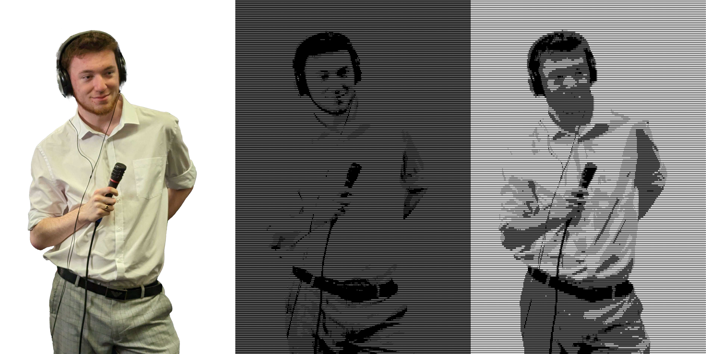
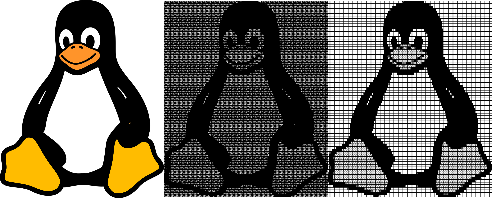

# img_to_ascii
Turn an image/video into its asciified variant.
```sh
[user@user img_to_ascii]$ python img_to_ascii.py -h
usage: img_to_ascii.py [-h] -i INPUT -o OUTPUT [-c CHARS] [-t TTF] [-v]

Converts image to its asciified variant

options:
  -h, --help            show this help message and exit
  -i INPUT, --input INPUT
                        File path for the input file.
  -o OUTPUT, --output OUTPUT
                        File path for the output.
  -c CHARS, --chars CHARS
                        Optional argument for a string specifying which ascii characters are permitted.
                        The empty character space, " ", is not included by unless specified.
                        Escaping certain characters may be required.
                        The default is: " !$^*()-+=|\/><~\#@^8:.,"
  -t TTF, --ttf TTF     Specify the file path for the TrueType Font to be used. The default font used is "dejavu-sans-mono".
  -v, --video           If the input is a video this must be enabled.
```
# Requirements
Requires Python 3.6+ as well as the following Python libraries:
* ```numpy>=1.24.2```
* ```Pillow>=10.2.0```

If you wish to convert video, in addition to the above, FFMPEG is required on the host machine as well as the Python library ```ffmpeg_python>=0.2.0```. See https://github.com/kkroening/ffmpeg-python for more details.

Alternatively the following pip command will install the requirements.

``` pip install -r requirements.txt```


# Examples
In the examples below, the right image is the original, the middle is converted using the default character set and the left image is converted using the character set "░▒▓█ ". For the gif the "--video" tag was used.







Here are some example commands:

* ```python img_to_ascii.py -i path/to/inputimage -o path/to/outputimage```
* ```python img_to_ascii.py -i path/to/inputimage -o path/to/outputimage -c "░▒▓█ "```
* ```python img_to_ascii.py -i path/to/inputvideo -o path/to/outputvideo -v```

# How it works
We make the image graycale and then split it into rectangular tiles that are the same size as the font we are using (16 x 8). For each tile, we then compute the "closest" ascii character to it. This is done by first converting the tile and each ascii character, which is a 16x8 matrix, into a 16x8=128 length vector (concatenate the rows). We then find the closest ascii charcacter geometrically (any norm in this 128 dimensional space works, we use L1 for simplicity).

A simpler way to do this is to assign a "grayscale" value to each ascii character and use this to find the corresponding ascii character for each tile. However the method used in this implementation allows edges in the image to be more accurately represented, at the cost of more computation.
